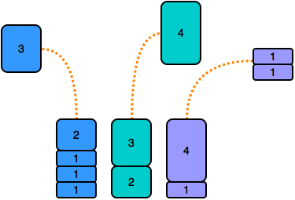

You have three stacks of cylinders where each cylinder has the same diameter, but they may vary in height. You
can change the height of a stack by removing and discarding its topmost cylinder any number of times.

Find the maximum possible height of the stacks such that all of the stacks are exactly the same height. This
means you must remove zero or more cylinders from the top of zero or more of the three stacks until they are all
the same height, then return the height.

**Example**\
h1 = [1,2,1,1]\
h2 = [1,2,2]\
h3 = [1,1,]

There are and cylinders in the three stacks, with their heights in the three arrays. Remove the top 2
cylinders from *h1* (heights = [1, 2]) and from *h2* (heights = [1, 1]) so that the three stacks all are 2 units tall.
Return **2** as the answer.

**Note:** An empty stack is still a stack.

**Function Description**

Complete the equalStacks function in the editor below.

equalStacks has the following parameters:
int h1[n1]: the first array of heights
int h2[n2]: the second array of heights
int h3[n3]: the third array of heights

**Returns**
int: the height of the stacks when they are equalized

**Input Format**

The first line contains three space-separated integers, *n1* , *n2*, and *n3* , the numbers of cylinders in stacks *1*, *2* and *3*,
and. The subsequent lines describe the respective heights of each cylinder in a stack from top to bottom:
- The second line contains *n1* space-separated integers, the cylinder heights in stack **1**. The first element is the
top cylinder of the stack.
- The third line contains *n2* space-separated integers, the cylinder heights in stack **2**. The first element is the
top cylinder of the stack.
The fourth line contains *n3* space-separated integers, the cylinder heights in stack **3**. The first element is the
top cylinder of the stack.

$$Constraints$$
$$0 < n_1, n_2, n_3 \leq 10^5$$
$$0 < height of any cylinder \leq 10^5$$


**Sample Input**


```
STDIN  Function
-----  --------
5 3 4  h1[] size n1 = 5, h2[] size n2 = 3, h3[] size n3 = 4
3 2 1  1 1 h1 = [3, 2, 1, 1, 1]
4 3 2  h2 = [4, 3, 2]
1 1 4  1 h3 = [1, 1, 4, 1]
```
**Sample Output**
```
5
```
**Explanation**

Initially, the stacks look like this:


To equalize thier heights, remove the first cylinder from stacks 1 and 2 , and then remove the top two cylinders
from stack 3 (shown below).




The stack heights are reduced as follows:
1. 8 - 3 = 5
2. 9 - 4 = 5
3. 7 - 1 - 1 = 5

All three stacks now have **height = 5**, the value to return.

link: [https://www.hackerrank.com/challenges/equal-stacks/problem?isFullScreen=true]


